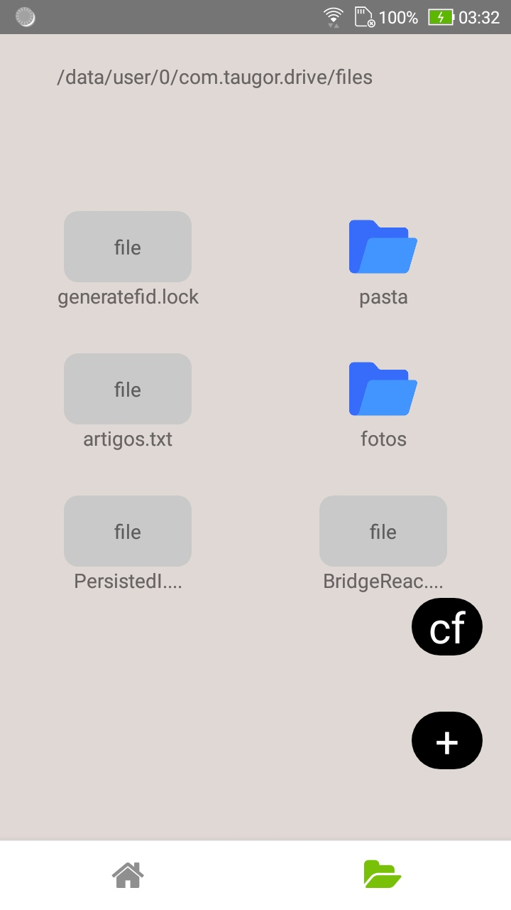

<h1 align="center"><a href="https://netflix-clone-5af4a.web.app" target="_blank" rel="noopener noreferrer">Taugor drive</a></h1>

     

  

    

   

     

<h2>Projeto</h2>

Objetivo deste teste é simples, fazer um aplicativo que faça login usando firebase com tela de
autenticação também usando google se ele quiser. O aplicativo é com foco de adastrar arquivos em geral, e poder listar os últimos 50 e claro
conforme ir rolando mostrar os outros.

   

     

     

O aplicativo é com foco de adastrar arquivos em geral, e poder listar os últimos 50 e claro
conforme ir rolando mostrar os outros.

   

     

     

<h2>Tecnologias</h2>
<ul>
   <li>React Native</li>
   <li>Firebase</li>
   <li>JavaScript</li>
   <li>CSS</li>
</ul>
